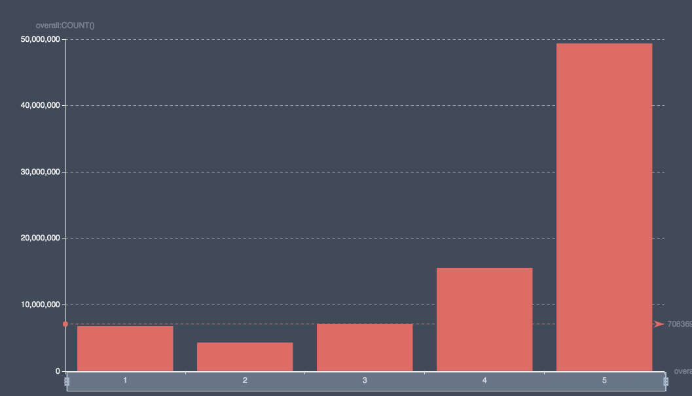

# Amazon Reivews & Product Metadata Insights

We use Docker Compose to containizer Spark Pipeline and Clickhouse Server.

## Insights

### Histogram of review score

```sql
SELECT overall, COUNT() as c from items group by overall ORDER BY overall
```

took 0.09 s and gave

```csv
"overall","c"
1,6767032
2,4290617
3,7083694
4,15543602
5,49372073
```

The histogram of overall in tabix .

We can filter by reviewer or review time and get overall distribution from a list of reviewers or during a period. We can also get heatmap which shows distribution evolution over time.

### Same `also_bought` and `also_viewed`

```sql
SELECT SUM(same_viewed_bought) AS same, COUNT() AS total FROM metadata
```

took 0.01 s and gave

```csv
same,total
4547982,9430088

```

## Run

1. Run `scrips/install.sh` to install Docker and Docker Compose on Ubuntu

2. Run `scripts/run.sh` to read data and store parsed data in clickhouse

3. Expose Clickhouse HTTP interface

  ```shell
  # forward clickhouse http interface
  # gcloud compute --project "youtube8m-winner" ssh --zone "europe-west4-a" "instance-3" -- -L 4040:localhost:4040 -L 8888:localhost:8888

  # give 127.0.0.1:8888 a public host so that grafana in a container does not resolve it wronlgy
  # ngrok http 8888
  ```
  
  `localhost:4040` points to Spark UI while `localhost:8888` points to Clickhouse HTTP interface.

  We need ngrok to give `localhost:8888` a unique and public accessible host so that grafana (in a container) is not confused.

4. Run `scripts/start-grafana.sh` to start a grafana container
  
  Visit [grafana](localhost:3000) to access grafana

5. Create a Grafana dashboard to show review histogram

## Spark Job

### Obsevations

* a gzipped file has to be read from its beginning to its end, which limits Spark's parallelism. So we run `gzip -k -d item_dedup_sample.json.gz` to unzip it first.

* The items file consists corrupted data, e.g. missing `unixReviewTime`, invalid `reviewTime` (`' 5, 2013'`). The strategy we take is to filter out data without required fields such as `reviewerID` and check if an optional field exists before accesing it.

* In a bigdata environment, errors are very hard to avoid. The startegy we take is to retry (for retryable errors).

### Stream local / remote gzipped json file

Since the file can be very large, processing while streaming it can take a while (ETL). So it is better to download to local storage and process it (ELT).

A python code to stream a remote gzipped json file with streaming in requests.

```python
import requests
r = requests.get('https://s3-eu-west-1.amazonaws.com/bigdata-team/job-interview/item_dedup.json.gz', stream=True)
help(r.iter_lines)
```

We also thought about setting a Kafka cluster to post json objects and the Spark job can consume from Kafka.

We also thought about sending json objects to local socket and the Spark job can use `socketTextStream` to read from it.

However, setting a Kafka cluster requires ZooKeeper and using `socketTextStream` is a bit tricky. The lastest stable Spark version 2.4.4 does not support Customer Source yet. So we decided to directly read from a large local json file, though unzipping took quite a bit time.

## Reviews

### Sample review

```json
{
  "reviewerID": "A2SUAM1J3GNN3B",
  "asin": "0000013714",
  "reviewerName": "J. McDonald",
  "helpful": [2, 3],
  "reviewText": "I bought this for my husband who plays the piano.  He is having a wonderful time playing these old hymns.  The music  is at times hard to read because we think the book was published for singing from more than playing from.  Great purchase though!",
  "overall": 5.0,
  "summary": "Heavenly Highway Hymns",
  "unixReviewTime": 1252800000,
  "reviewTime": "09 13, 2009"
}
```

where

```text
reviewerID - ID of the reviewer, e.g. A2SUAM1J3GNN3B
asin - ID of the product, e.g. 0000013714
reviewerName - name of the reviewer
helpful - helpfulness rating of the review, e.g. 2/3
reviewText - text of the review
overall - rating of the product
summary - summary of the review
unixReviewTime - time of the review (unix time)
reviewTime - time of the review (raw)
```

## Metadata

### Sample item

```json
{
  "asin": "0000031852",
  "title": "Girls Ballet Tutu Zebra Hot Pink",
  "price": 3.17,
  "imUrl": "http://ecx.images-amazon.com/images/I/51fAmVkTbyL._SY300_.jpg",
  "related":
  {
    "also_bought": ["B00JHONN1S", "B002BZX8Z6", "B00D2K1M3O", "0000031909", "B00613WDTQ", "B00D0WDS9A", "B00D0GCI8S", "0000031895", "B003AVKOP2", "B003AVEU6G", "B003IEDM9Q", "B002R0FA24", "B00D23MC6W", "B00D2K0PA0", "B00538F5OK", "B00CEV86I6", "B002R0FABA", "B00D10CLVW", "B003AVNY6I", "B002GZGI4E", "B001T9NUFS", "B002R0F7FE", "B00E1YRI4C", "B008UBQZKU", "B00D103F8U", "B007R2RM8W"],
    "also_viewed": ["B002BZX8Z6", "B00JHONN1S", "B008F0SU0Y", "B00D23MC6W", "B00AFDOPDA", "B00E1YRI4C", "B002GZGI4E", "B003AVKOP2", "B00D9C1WBM", "B00CEV8366", "B00CEUX0D8", "B0079ME3KU", "B00CEUWY8K", "B004FOEEHC", "0000031895", "B00BC4GY9Y", "B003XRKA7A", "B00K18LKX2", "B00EM7KAG6", "B00AMQ17JA", "B00D9C32NI", "B002C3Y6WG", "B00JLL4L5Y", "B003AVNY6I", "B008UBQZKU", "B00D0WDS9A", "B00613WDTQ", "B00538F5OK", "B005C4Y4F6", "B004LHZ1NY", "B00CPHX76U", "B00CEUWUZC", "B00IJVASUE", "B00GOR07RE", "B00J2GTM0W", "B00JHNSNSM", "B003IEDM9Q", "B00CYBU84G", "B008VV8NSQ", "B00CYBULSO", "B00I2UHSZA", "B005F50FXC", "B007LCQI3S", "B00DP68AVW", "B009RXWNSI", "B003AVEU6G", "B00HSOJB9M", "B00EHAGZNA", "B0046W9T8C", "B00E79VW6Q", "B00D10CLVW", "B00B0AVO54", "B00E95LC8Q", "B00GOR92SO", "B007ZN5Y56", "B00AL2569W", "B00B608000", "B008F0SMUC", "B00BFXLZ8M"],
    "bought_together": ["B002BZX8Z6"]
  },
  "salesRank": {"Toys & Games": 211836},
  "brand": "Coxlures",
  "categories": [["Sports & Outdoors", "Other Sports", "Dance"]]
}
```

where

```text
asin - ID of the product, e.g. 0000031852
title - name of the product
price - price in US dollars (at time of crawl)
imUrl - url of the product image
related - related products (also bought, also viewed, bought together, buy after viewing)
salesRank - sales rank information
brand - brand name
categories - list of categories the product belongs to
```

## Download files to a GCP compute engine

```shell
curl -o item_dedup.json.gz https://s3-eu-west-1.amazonaws.com/bigdata-team/job-interview/item_dedup.json.gz
curl -o metadata.json.gz https://s3-eu-west-1.amazonaws.com/bigdata-team/job-interview/metadata.json.gz
```
